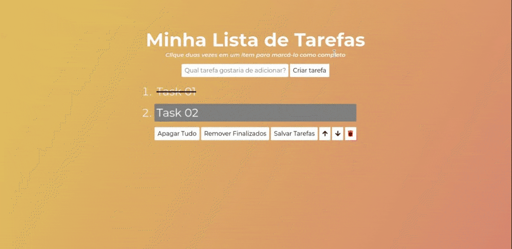

# Todo List !

The idea with this project is a to-do list, where the user can create, mark as done, delete and move a priority task, the user can also save the task list in LocalStorage, and it is possible to keep the saved tasks.

It was developed using HTML, CSS and JavaScript, and has as a study goal, to understand how to manipulate the DOM, and persist data in the browser, using JavaScript.

 

 

# Technologies Used

For this project the following technologies were used:

- [JavaScript](https://developer.mozilla.org/pt-BR/docs/Web/JavaScript)
- [CSS](https://developer.mozilla.org/pt-BR/docs/Web/CSS)
- [Docker](https://www.docker.com/)

## How to Use:

1. Clone the repository

  ~~~bash
  git clone git@github.com:JeffThierch/Todo-List.git
  ~~~

3. In the root of the project change the .env_example file to .env

4. (Optional) - Change the environment variables.

5. In the root of project run the commands:

  ~~~bash
  docker-compose up --build
  ~~~

6. If everything is configured correctly, after the build process you can simply access the application.
